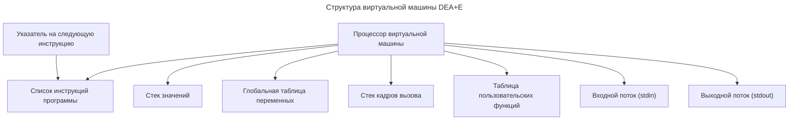

# Виртуальная машина DEA+E

Виртуальная машина DEA+E выполняет инструкции по определённым правилам, тем самым обеспечивая возможность вычисления программ на DEA+E, использующих базовые типы данных, переменные, ввод-вывод, операции над числами и строками, логические операции, пользовательские и встроенные функции, ветвления.

Эта статья описывает принцип работы (модель работы) виртуальной машины DEA+E на данном этапе реализации.

## Иллюстрация

Иллюстрация структуры виртуальной машины DEA+E в текущей реализации:

## Модель виртуальной машины

Структура машины DEA+E в текущей реализации состоит из следующих элементов:

1. Список инструкций, составляющих программу;
2. Указатель на следующую инструкцию;
3. Стек значений, используемый для вычисления выражений;
4. Глобальная таблица переменных, в которой хранятся глобальные переменные и константы;
5. Стек кадров вызова, используемый при вызове пользовательских функций и процедур.
   
   - Каждый кадр вызова хранит адрес возврата, сведения о вызываемой функции и таблицу её локальных переменных;
6. Таблица пользовательских функций, содержащая точки входа функций и информацию об их параметрах;
7. Входной поток (`stdin`);
8. Выходной поток (`stdout`);
9. Процессор, обрабатывающий инструкции.

## Инструкции

Каждая инструкция программы содержит:

1. Код инструкции из набора инструкций;
2. Значение операнда (необязательное).

## Набор инструкций

Каждая инструкция может иметь один операнд, который хранится вместе с инструкцией.

Условные обозначения в списке инструкций:

- Операнд указывается в квадратных скобках, например: `[Value]`;
- Вершина стека вычислений обозначается `EVAL[^1]`, следующее за ней значение — `EVAL[^2]`, затем `EVAL[^3]` и так далее;
- Каждая инструкция имеет свой номер (индекс), нумерация инструкций начинается с 0.

Список инструкций:

1. `Push [Value]` добавляет значение на стек вычислений
    - Операнд хранит добавляемое значение.

2. `DefineVar [Name]` создаёт новую переменную с именем `[Name]`
    - Операнд хранит имя переменной.
    - Перед выполнением инструкции на стеке должны находиться три значения:
      - `EVAL[^1]` — тег типа;
      - `EVAL[^2]` — тег константности;
      - `EVAL[^3]` — начальное значение либо `Void`.
    - Снимает три значения со стека вычислений.
    - Бросает исключение, если имя уже существует в текущей таблице переменных.

3. `LoadVar [Name]` читает значение переменной
    - Операнд хранит имя переменной.
    - Помещает результат в стек вычислений.
    - Бросает исключение, если переменная не объявлена.
    - Бросает исключение, если переменная не инициализирована.

4. `StoreVar [Name]` записывает в ранее созданную переменную значение `EVAL[^1]`
    - Операнд хранит имя переменной.
    - Убирает значение со стека вычислений.
    - Бросает исключение, если переменная не объявлена.
    - Бросает исключение, если переменная объявлена как `const`.

5. `InputVar [Name]` читает значение из входного потока и записывает его в переменную `[Name]`
    - Операнд хранит имя переменной.
    - Стек вычислений не используется.
    - Бросает исключение, если переменная не объявлена.
    - Бросает исключение, если переменная объявлена как `const`.
    - Бросает исключение, если считанное значение нельзя преобразовать к типу переменной.

6. `Add` выполняет бинарную операцию сложения
    - Вычисляет `EVAL[^2] + EVAL[^1]`.
    - Снимает два значения со стека вычислений, результат помещает в стек вычислений.
    - Для строк выполняет конкатенацию.
    - Бросает исключение для неподдерживаемых типов.

7. `Subtract` выполняет бинарную операцию вычитания
    - Вычисляет `EVAL[^2] - EVAL[^1]`.
    - Снимает два значения со стека вычислений, результат помещает в стек вычислений.
    - Бросает исключение для неподдерживаемых типов.

8. `Multiply` выполняет бинарную операцию умножения
    - Вычисляет `EVAL[^2] * EVAL[^1]`.
    - Снимает два значения со стека вычислений, результат помещает в стек вычислений.
    - Бросает исключение для неподдерживаемых типов.

9. `Divide` выполняет бинарную операцию деления
    - Вычисляет `EVAL[^2] / EVAL[^1]`.
    - Снимает два значения со стека вычислений, результат помещает в стек вычислений.
    - Бросает исключение, если операнды не являются числами.
    - Бросает исключение, если делитель равен нулю.

10. `IntegerDivide` выполняет бинарную операцию целочисленного деления
    - Вычисляет `EVAL[^2] // EVAL[^1]`.
    - Снимает два значения со стека вычислений, результат помещает в стек вычислений.
    - Бросает исключение, если операнды не имеют тип `int`.
    - Бросает исключение, если делитель равен нулю.

11. `Modulo` выполняет бинарную операцию остатка от деления
    - Вычисляет `EVAL[^2] % EVAL[^1]`.
    - Снимает два значения со стека вычислений, результат помещает в стек вычислений.
    - Бросает исключение, если операнды не имеют тип `int`.
    - Бросает исключение, если делитель равен нулю.

12. `Power` выполняет бинарную операцию возведения в степень
    - Вычисляет `EVAL[^2] ^ EVAL[^1]`.
    - Снимает два значения со стека вычислений, результат помещает в стек вычислений.
    - Бросает исключение для неподдерживаемых типов.

13. `Negate` выполняет унарную операцию "минус"
    - Снимает значение со стека вычислений, результат помещает в стек вычислений.
    - Бросает исключение для неподдерживаемых типов.

14. `CallBuiltin [Code]` вызывает встроенную функцию
    - Операнд хранит целочисленный номер встроенной функции.
    - Указатель инструкций не меняется.
    - Аргументы передаются через стек, где `EVAL[^1]` — последний из `N` аргументов, а `EVAL[^N]` — первый аргумент.
    - Возвращаемое значение (если оно есть) передаётся через стек в `EVAL[^1]`.
    - Поддерживаются следующие встроенные функции:
      - `0` — `Print`;
      - `1` — `Len`;
      - `2` — `Substr`;
      - `3` — `Abs`;
      - `4` — `Min`;
      - `5` — `Max`.

15. `CallUser [Name]` вызывает пользовательскую функцию или процедуру
    - Операнд хранит имя вызываемой функции или процедуры.
    - Аргументы передаются через стек, где `EVAL[^1]` — последний из `N` аргументов, а `EVAL[^N]` — первый аргумент.
    - Прежнее значение указателя инструкций и таблица локальных переменных сохраняются в стек кадров вызова.
    - Переход выполняется на точку входа вызываемой функции или процедуры.
    - Возвращаемое значение (если оно есть) передаётся через стек в `EVAL[^1]`.

16. `Return` завершает текущую функцию или процедуру
    - Восстанавливает значение указателя инструкций, снимая текущий кадр вызова со стека кадров вызова.
    - Если функция имеет возвращаемое значение, то результат функции остаётся в стеке вычислений.

17. `Jump [Target]` выполняет безусловный переход
    - Операнд хранит номер инструкции, на которую выполняется переход.

18. `JumpIfFalse [Target]` выполняет условный переход, если условие ложно
    - Операнд хранит номер инструкции, на которую выполняется переход.
    - Переход выполняется, если `EVAL[^1]` имеет значение `false`.
    - Снимает одно значение из стека.
  
19. `ToBool` преобразует значение к `bool`
    - Снимает значение со стека вычислений, результат помещает в стек вычислений.

20. `Not` выполняет унарную операцию логического отрицания
    - Снимает значение со стека вычислений, результат помещает в стек вычислений.

21. `Equal` выполняет бинарную операцию "равно"
    - Вычисляет `EVAL[^2] = EVAL[^1]`.
    - Снимает два значения со стека вычислений, результат помещает в стек вычислений.

22. `NotEqual` выполняет бинарную операцию "не равно"
    - Вычисляет `EVAL[^2] <> EVAL[^1]`.
    - Снимает два значения со стека вычислений, результат помещает в стек вычислений.

23. `Less` выполняет бинарную операцию "меньше"
    - Вычисляет `EVAL[^2] < EVAL[^1]`.
    - Снимает два значения со стека вычислений, результат помещает в стек вычислений.

24. `LessOrEqual` выполняет бинарную операцию "меньше или равно"
    - Вычисляет `EVAL[^2] <= EVAL[^1]`.
    - Снимает два значения со стека вычислений, результат помещает в стек вычислений.

25. `Greater` выполняет бинарную операцию "больше"
    - Вычисляет `EVAL[^2] > EVAL[^1]`.
    - Снимает два значения со стека вычислений, результат помещает в стек вычислений.

26. `GreaterOrEqual` выполняет бинарную операцию "больше или равно"
    - Вычисляет `EVAL[^2] >= EVAL[^1]`.
    - Снимает два значения со стека вычислений, результат помещает в стек вычислений.

27. `Halt` останавливает работу программы
    - Снимает значение со стека вычислений, используя его как целочисленный код возврата.